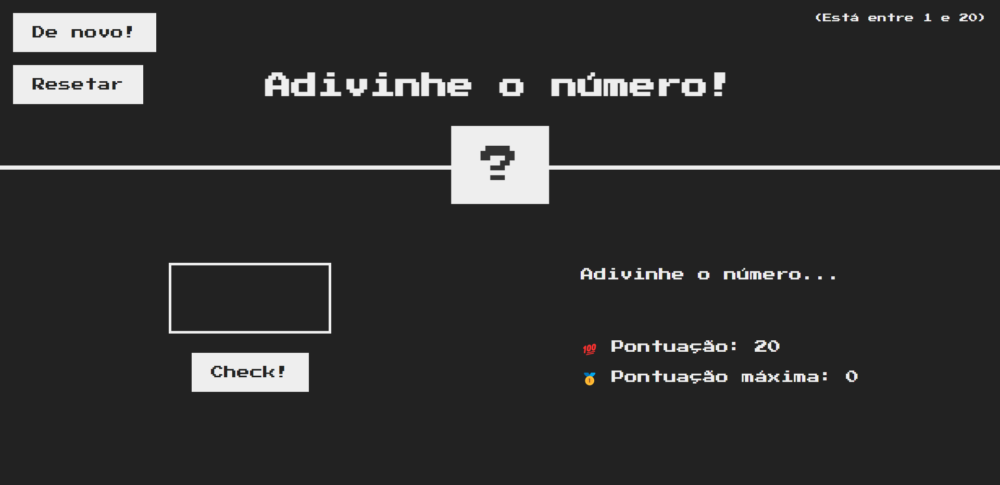

# Adivinhe o número!

Atividade realizada durante o curso <a href="https://www.udemy.com/course/the-complete-javascript-course/">The Complete JavaScript Course 2022: From Zero to Expert!</a>

É um mini game para adivinhar um número entre 1 e 20. O objetivo desta atividade é aprender a manipular o DOM.

Adicionei o recurso de <a href="https://javascript.info/localstorage">logal storage</a> que eu já conhecia e uma mini <a href="https://party.js.org/">biblioteca que adiciona efeitos de confete</a> na página

